## 基于VirtualBox的网络攻防基础环境搭建实例 
### 网络拓扑图：
- 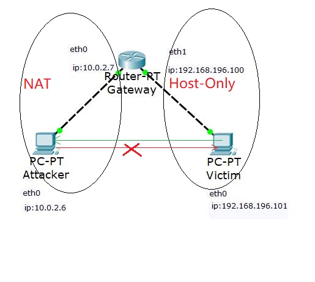
### 一、基本环境搭建
1. 建立三个kali虚拟机且均使用多重挂载，并分别命名为：
- 网关：
- - 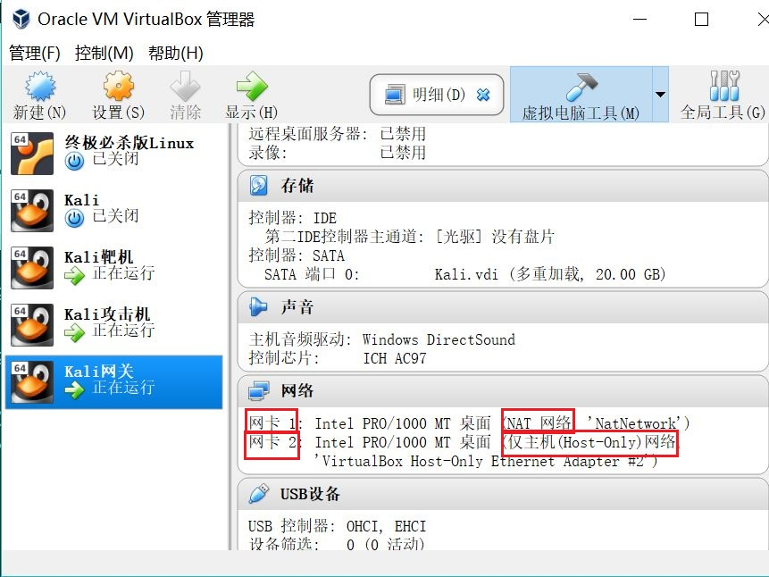
- 攻击机：
- - 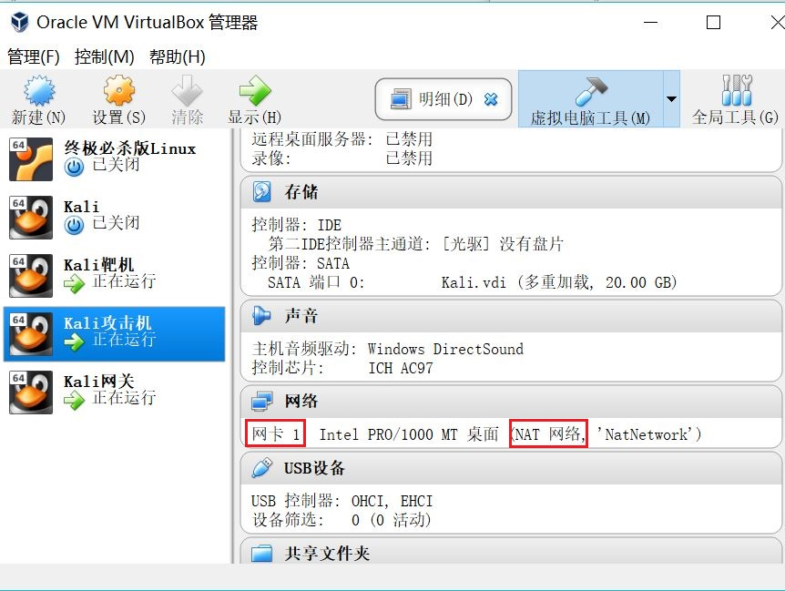
- 靶机：
- - 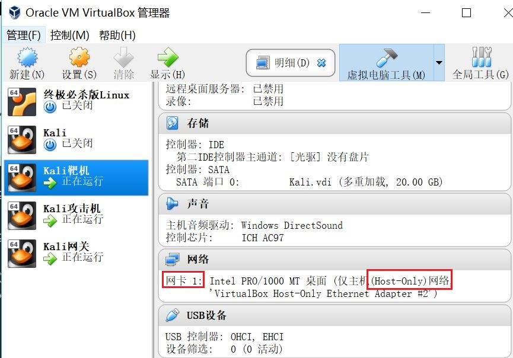
2. 网络设置：
- 为网关设置两张网卡，一张模式为NAT网络，另一张模式为Host-Only网络
- 攻击机网络设置为NAT网络
- 靶机网卡设置为Host-Only网络
- - 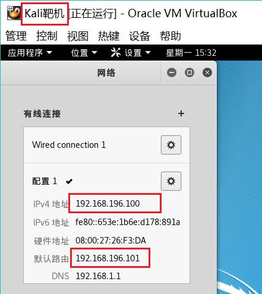
- - 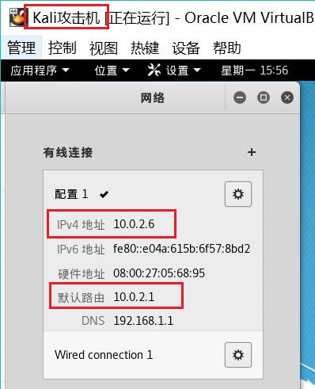
- - 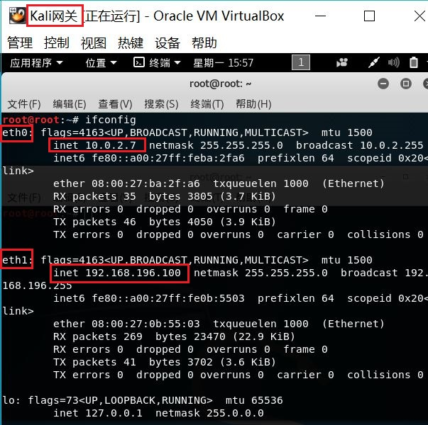
- 内网网段设置为192.168.196.0，外网网段设置为10.0.2.0，靶机的ip设置为192.168.196.101，攻击机的ip设置为10.0.2.6
- - 将靶机的默认路由设置为网关的Host-Only网卡地址，即192.168.196.100
- - 将网关的内部网络的默认路由设置为网关的外部网络地址，即10.0.2.7
- 此时实现了靶机和网关的互相ping通以及攻击机与网关的互相ping通。但靶机与攻击机不能互相ping通

### 二、转发配置
- 此时分析靶机ping不通攻击机的原因：
- - 在靶机上ping攻击机，同时在网关和攻击机中使用wireshark抓包，如下图所示
- - 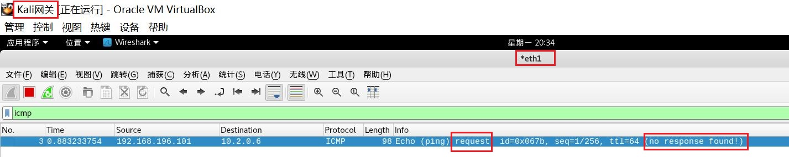
- - 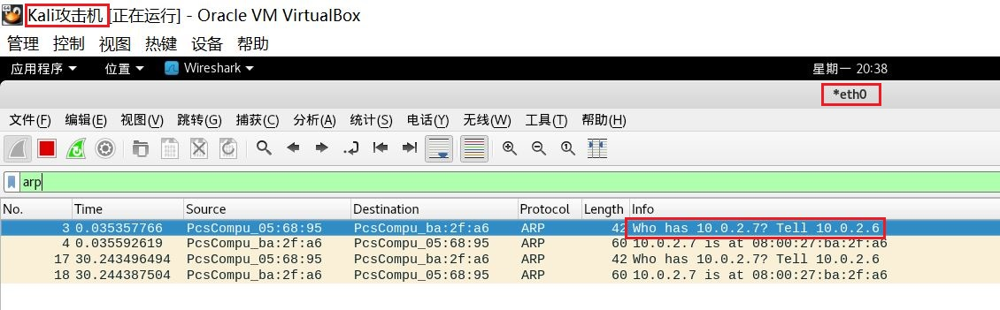
- - 网关的eth0与靶机在同一网段。可以看出，靶机在ping攻击机的时候，将request数据包发送给网关，但并未收到回应（no response found!）
- - 而从攻击机处抓取的数据包来看，攻击机已经收到了靶机的request包，但是在回复的时候并没有发送给网关，从而导致靶机无法ping通攻击机。
- 此时需要进行转发配置，从而使reply包能够经由网关发送到靶机。
- 开启转发功能：
- - 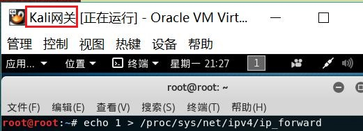
- 在网关中配置：
- - 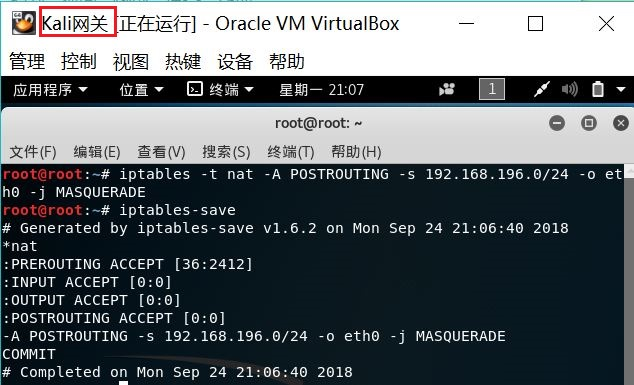
- 可以观察到，靶机可以ping通攻击机了
- - 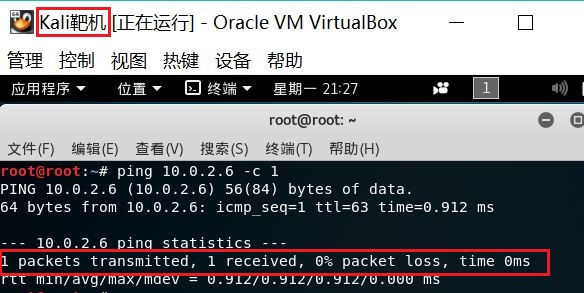
- 但此时，攻击机也可以直接ping通靶机。因此需要在靶机上设置防火墙规则使攻击机不能直接访问靶机

### 三、防火墙设置
- 利用iptables命令设置靶机，使靶机应达到的效果：
- - 接收来自于lo接口的数据包：```iptables -A INPUT -i lo -j ACCEPT```
- - 接收已经建立连接的数据包：```iptables -A INPUT -m state --state RELATED,ESTABLISHED -j ACCEPT```
- - 允许网关访问：```iptables -I INPUT -s 网关IP -ptcp -j ACCEPT```以及```iptables -I INPUT -s 网关IP -p icmp -j ACCEPT```
- - 禁止其他未允许的规则访问：```iptables -A INPUT -j REJECT```
- 查看已添加的iptables规则：
- - 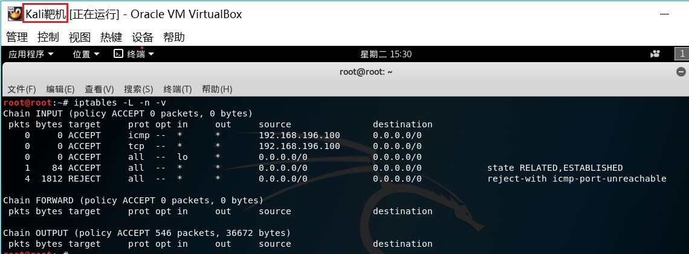
- 保存设置的iptables规则：
```
cat << EOF >  /etc/network/if-pre-up.d/firewall
#!/bin/sh
/usr/sbin/iptables-restore  <  /etc/iptables.rules
exit 0
EOF
chmod +x  /etc/network/if-pre-up.d/firewall

cat << EOF >  /etc/network/if-post-down.d/firewall
#!/bin/sh
/usr/sbin/iptables-save  -c  >  /etc/iptables.rules
exit 0
EOF
chmod +x  /etc/network/if-post-down.d/firewall
```
- 此时，攻击机无法直接访问靶机
- - 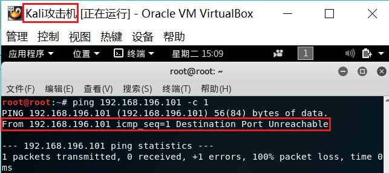
- 参考链接：
- - [iptables实现网络防火墙](https://blog.csdn.net/eumenides_s/article/details/78316775)
- - [jackcily的博客](https://blog.csdn.net/jackcily/article/details/82807757)

### 四、流量监听
- 靶机ping攻击机，开启攻击机eth0端口和网关eth1端口的监听：
- - 网关监听：```tcpdump -n -i eth1 icmp```
- - 攻击机监听：```tcpdump -n -i eth0 icmp```
- 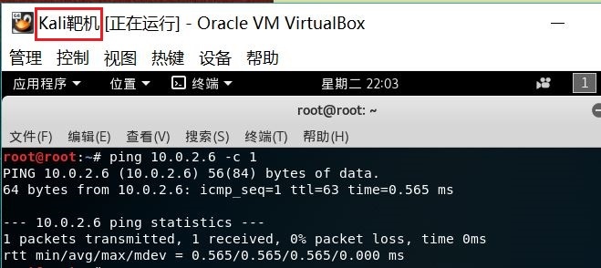
- 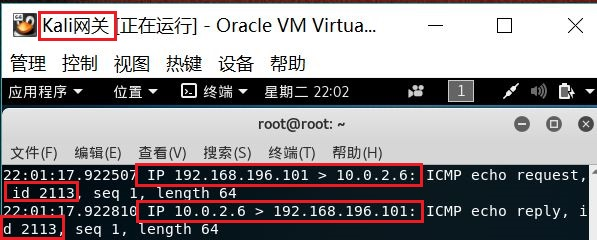
- 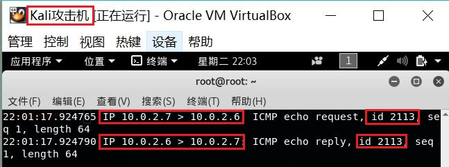

### 五、互联网访问
- 此时，网关和攻击机均可访问互联网：
- - 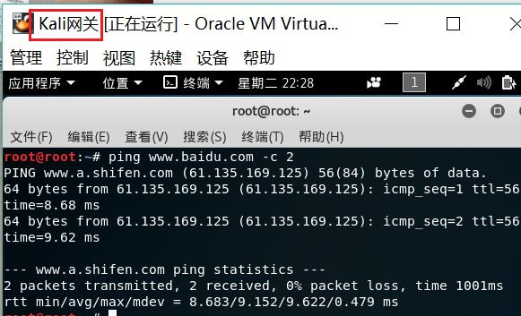
- - 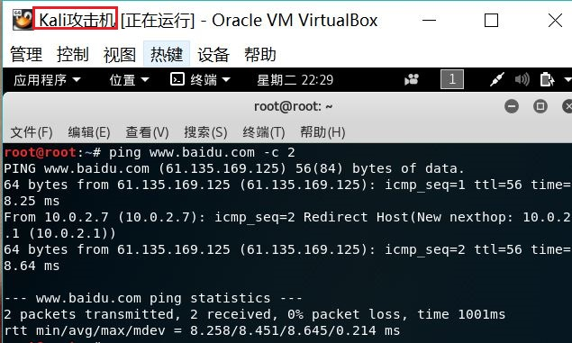
- 将靶机的DNS设置为8.8.8.8
- - 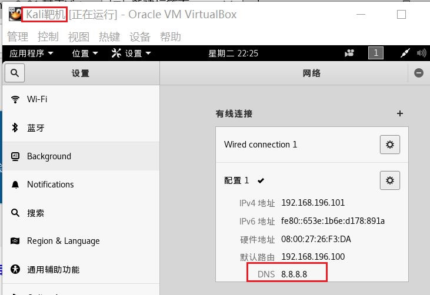
- 此时，靶机可以访问互联网
- - 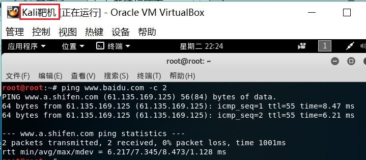
- 
### 六、实验成果展示
- 连通性：
- 1. 靶机可以直接访问攻击者主机：
- 
- 2. 攻击者主机无法直接访问靶机：
- 
- 3. 网关可以直接访问攻击者主机和靶机：
- 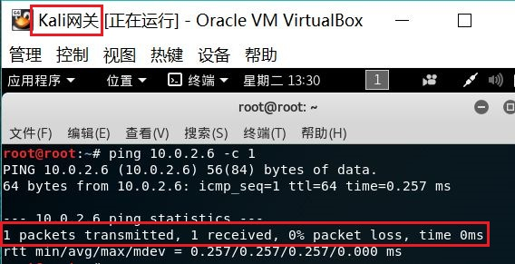
- 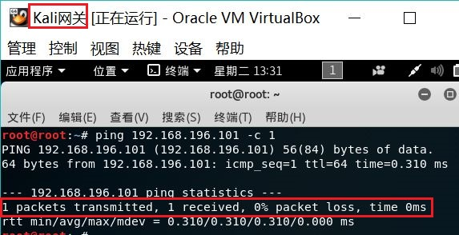
- 4. 靶机的所有对外上下行流量必须经过网关
- - 由第四步可知
- 5. 所有节点均可以访问互联网
- 
- 
- 
- 其他要求：
- - 所有节点制作成基础镜像（多重加载的虚拟硬盘）：
- - 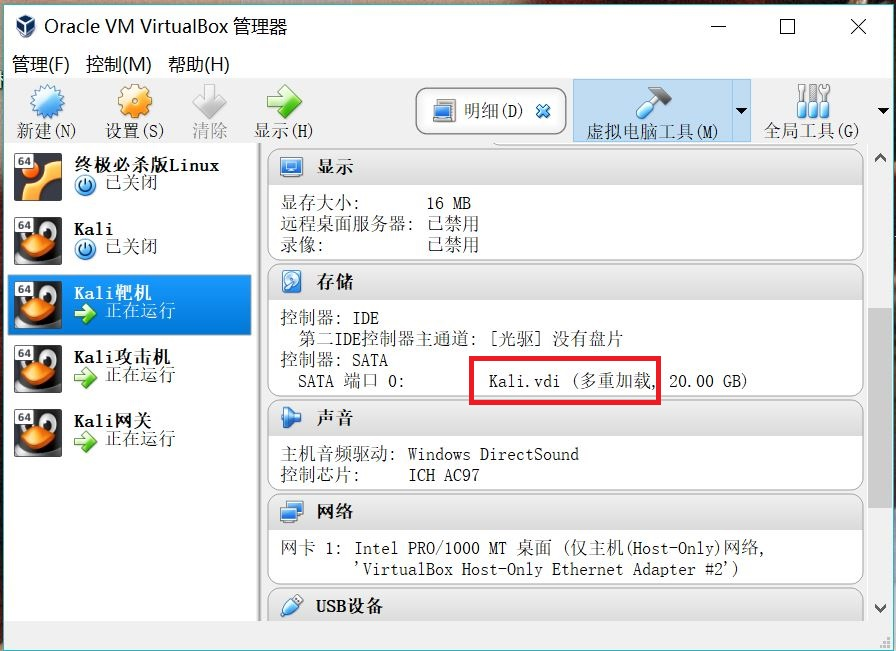
- - 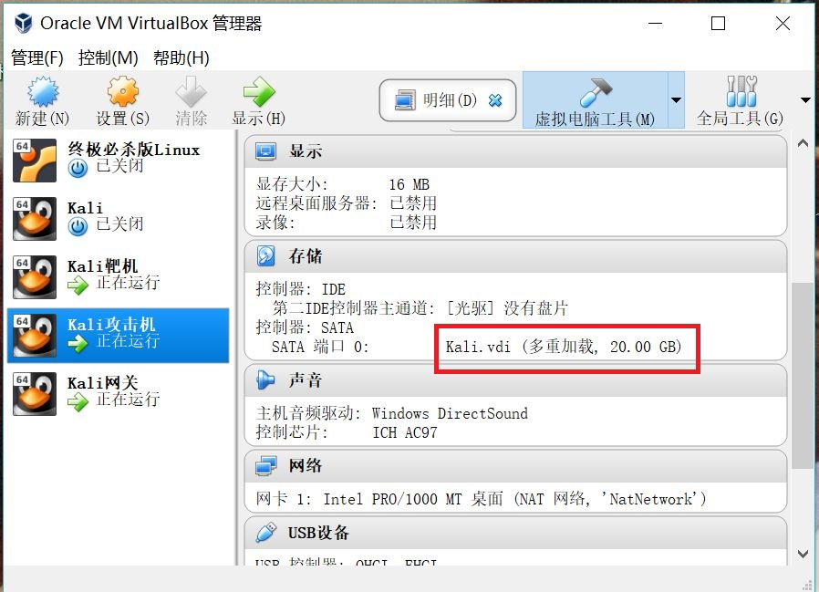
- - 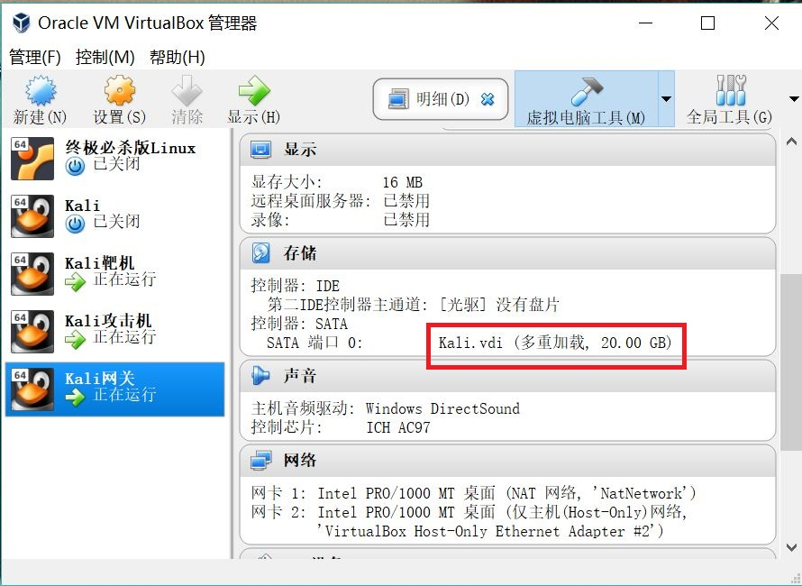