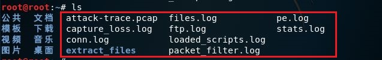
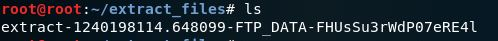
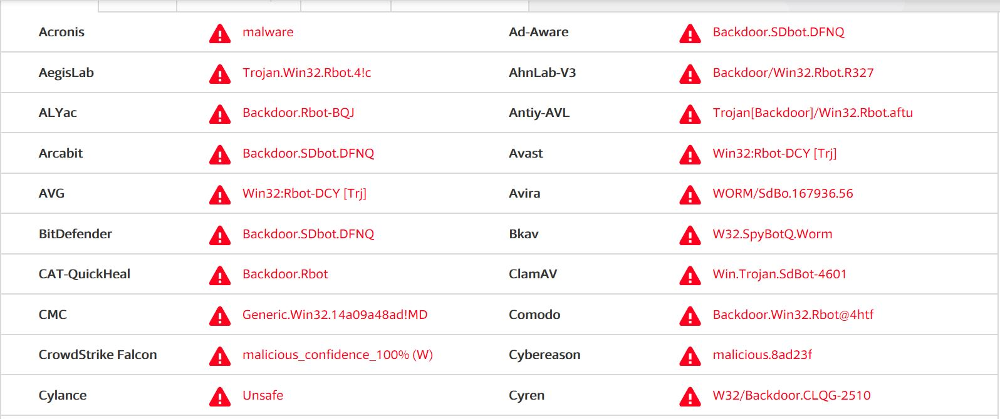
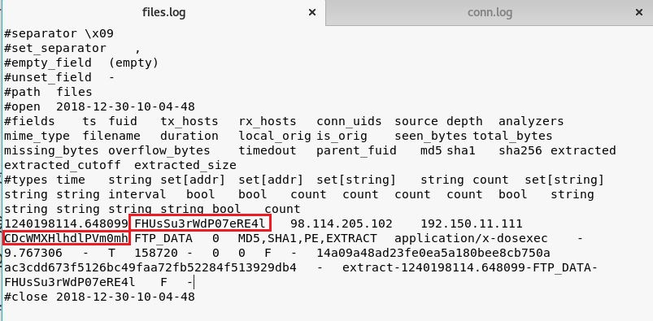
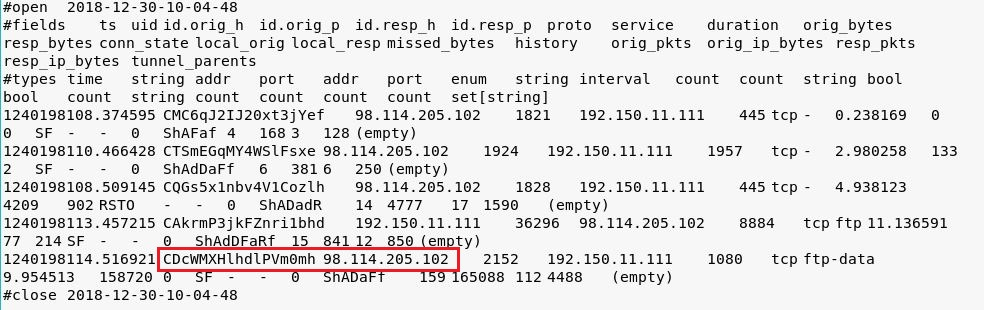

## chap0x12 实战Bro网络入侵取证
### 一、环境准备
**安装bro：**

```apt-get install -y bro bro-aux```

**编辑bro配置文件：**

对/etc/bro/site/local.bro进行编辑，在文件尾部追加两行新配置

```txt
@load frameworks/files/extract-all-files # 提取所有文件
@load mytuning.bro
```

在/etc/bro/site/目录下创建新文件mytuning.bro，该文件内容如下：

```redef ignore_checksums = T;```

### 二、使用bro自动化分析pcap文件
**下载pcap包：**

```wget  https://sec.cuc.edu.cn/huangwei/textbook/ns/chap0x12/attack-trace.pcap```

**使用bro进行分析：**

```bro -r attack-trace.pcap /etc/bro/site/local.bro``` 

在attack-trace.pcap文件的当前目录下会生成一些.log文件和一个extract_files目录



出现警告信息：```WARNING: No Site::local_nets have been defined. It's usually a good idea to define your local networks.```对于本次入侵取证实验来说没有影响。

在```extract_files```目录下发现一个文件：



将该文件上传到[VirusTotal](https://www.virustotal.com/#/home/upload)进行分析，得到结果：



可以发现这是一个已知的后门程序，可以由此寻找入侵线索。

通过阅读```/usr/share/bro/base/files/extract/main.bro```的代码:

```txt
 function on_add(f: fa_file, args: Files::AnalyzerArgs)
 	{
 	if ( ! args?$extract_filename )
 		args$extract_filename = cat("extract-", f$last_active, "-", f$source, "-", f$id);
 	f$info$extracted = args$extract_filename;
 	args$extract_filename = build_path_compressed(prefix, args$extract_filename);
 	f$info$extracted_cutoff = F;
 	mkdir(prefix);
 	}
```

可以发现，文件的唯一标识符```id```就是在文件名中，最后一个```-```分割符分割后的部分。因此，上述文件的id即为```FHUsSu3rWdP07eRE4l```

通过查看```files.log```，发现该文件提取自网络会话标识为```CDcWMXHlhdlPVm0mh```的FTP会话。



在```conn.log```中，根据会话标识```CDcWMXHlhdlPVm0mh```可以找到发送方ip为```98.114.205.102```



**参考资料：**

[textbook](http://sec.cuc.edu.cn/huangwei/textbook/ns/chap0x12/exp.html)
