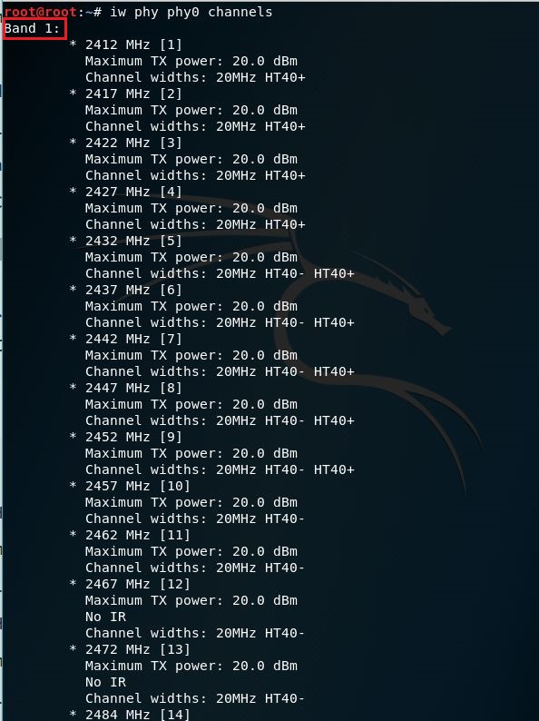

## 实验2 无线接入网监听实验
### 一、接入无线网卡
- 接入网卡：```lsusb```


- 查看所有活动（不包括被禁用网卡）：```ifconfig```


- 无线网卡参数配置命令：```iwconfig```


- 确保无线网卡的工作模式是managed，且Access Poit值为Not-Associated

- 查看<phy_name>：```iw phy```


- 查看当前网卡支持的监听channel：```iw phy <phy_name> channels```




- 以上输出信息中可以发现此为支持双频（2.4GHz/5GHz）无线网卡的典型输出

### 二、设置监听模式
- 解决部分无线网卡在Kali 2.0系统中设置监听模式失败，杀死可能会导致aircrack-ng套件工作异常的相关进程：```airmon-ng check kill```


- 设置wlan0工作在监听模式：```airmon-ng start wlan0```


- 检查无线网卡是否已处于启用状态，以下命令的输出中应出现网卡名wlan0mon：```ifconfig```


- 检查无线网卡是否已切换到监听模式，wlan0mon的Mode应显示为Monitor：```iwconfig```


### 三、无线数据抓包
- 开始以channel hopping模式抓包：```airodump-ng wlan0mon```


- 选择一个"感兴趣"的目标AP进行定向（指定工作channel）监听并将结果保存到本地文件：```airodump-ng wlan0mon --channel 13 -w saved --beacons --wps```
- 查看保存的文件


- 用wireshark查看pcap文件


### 四、分析抓包数据
- [ ] Q1：查看统计当前信号覆盖范围内一共有多少独立的SSID？其中是否包括隐藏SSID？哪些无线热点是加密/非加密的？加密方式是否可知？
- 从捕捉的包中过滤出所有的Beacon frames：```wlan.fc.type_subtype == 0x0008```


- 查看WLAN流量，可以看出SSID信息


- 显示为broadcast的SSID表示AP没有用任何SSID发送自己的beacon frame，即为隐藏SSID
- 由上图可知，==独立的SSID有5个，隐藏SSID有1个==
- - -
- 热点是否加密可以查看帧的wlan.fixed.capabilities.privacy段:
- - 0表示未加密
- - 1表示已加密
- 查看加密热点：```wlan.fc.type_subtype == 0x0008 && wlan.fixed.capabilities.privacy == 1```


- 查看非加密热点：```wlan.fc.type_subtype == 0x0008 && wlan.fixed.capabilities.privacy == 0```


- 由图可知，==加密热点有2个，非加密热点有1个==
- - -
- 加密的方式可以通过抓包截图判断：
- - OPN表示不加密
- - WPA2，WPA表示加密方式


- 由图可知，==加密方式有WPA，WPA2两种，以及开放的OPN==

-  [ ] Q2：如何分析出一个指定手机在抓包时间窗口内在手机端的无线网络列表可以看到哪些SSID？这台手机尝试连接了哪些SSID？最终加入了哪些SSID？
-  若指定手机在监听模式的网卡覆盖范围内，则==非隐藏SSID都可以在手机端的无线网络列表看到==
- - -
- 查看手机尝试连接哪些SSID可通过：```wlan.fc.type_subtype == 0x0004```，查看手机向哪些AP发送Request帧来确定


- 查看手机最终加入了哪些SSID可通过：```wlan.fc.type_subtype == 0x0000```，查看AP恢复的Response帧来确定


- 由图可知，==此次试验中，手机并没有加入某个SSID==

-  [ ] Q3：SSID包含在哪些类型的802.11帧？
- SSID应包含在Beacon Frame、Probe Request、Probe Response、Association RequestReassociation Request帧中
- 通过```wlan.ssid```：


- 由图可知，==此次实验中，Beacon Frame，Probe Response帧，Probe Request帧包含SSID==

###### 参考资料：
- [Pcap capture : View SSID AP names in Wireshark ](https://www.algissalys.com/network-security/pcap-capture-view-ssid-ap-names-in-wireshark)
- [Jasmine2020](https://github.com/CUCCS/2018-NS-Public-Jasmine2020/blob/f55fcc67135fc4422507178f753b31b99b0e4f43/MobileSecurityHw02/mis_02无线接入网监听.md)
- [MrCuihi](https://github.com/CUCCS/2018-NS-Public-MrCuihi/blob/e8a2ee6064d77329531057556d233cbe0d01a25c/802.11网络监听实验报告.md)