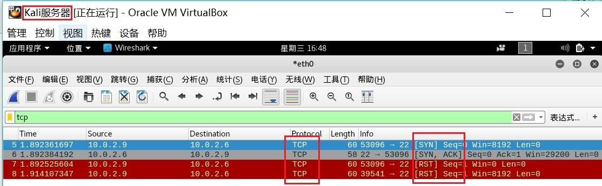

## chap0x05 端口扫描
### 实验目标：
- [ ] TCP connect scan
- [ ] TCP stealth scan
- [ ] TCP XMAS scan
- [ ] UDP scan

### 实验环境：
- 客户端ip：10.0.2.9
- 服务器ip：10.0.2.6

### 实验过程：

##### 一、TCP connect scan：

原理：


代码：

```txt
import logging
logging.getLogger("scapy.runtime").setLevel(logging.ERROR)
from scapy.all import *

dst_ip = "10.0.2.6"  #服务器ip地址
src_port = RandShort()
dst_port=80          #请求80端口

tcp_connect_scan_resp = sr1(IP(dst=dst_ip)/TCP(sport=src_port,dport=dst_port,flags="S"),timeout=10)
if(str(type(tcp_connect_scan_resp))=="<type 'NoneType'>"):
       print "Closed"
elif(tcp_connect_scan_resp.haslayer(TCP)):
       if(tcp_connect_scan_resp.getlayer(TCP).flags == 0x12):
               send_rst = sr(IP(dst=dst_ip)/TCP(sport=src_port,dport=dst_port,flags="AR"),timeout=10)
               print "Open"
       elif (tcp_connect_scan_resp.getlayer(TCP).flags == 0x14):
               print "Closed"
```

结果：

- 服务器使用nmap扫描自身，查看端口状态：


- 在客户端运行TCP_connect_scan.py文件，并在服务器端使用wireshark监听：


- 可以看到输出为'Closed'，并且服务器端返回了RST包，说明服务器80端口是关闭的。
- 服务器开启apache2，即80端口：


- 重新检测：


- 可以看到输出为'Open'，并完成了三次握手。

##### 二、TCP stealth scan：

原理：


代码：

```txt
import logging
logging.getLogger("scapy.runtime").setLevel(logging.ERROR)
from scapy.all import *

dst_ip = "10.0.2.6"
src_port = RandShort()
dst_port=22

stealth_scan_resp = sr1(IP(dst=dst_ip)/TCP(sport=src_port,dport=dst_port,flags="S"),timeout=10)
if(str(type(stealth_scan_resp))=="<type 'NoneType'>"):
       print "Filtered"
elif(stealth_scan_resp.haslayer(TCP)):
       if(stealth_scan_resp.getlayer(TCP).flags == 0x12):
               send_rst = sr(IP(dst=dst_ip)/TCP(sport=src_port,dport=dst_port,flags="R"),timeout=10)
               print "Open"
       elif (stealth_scan_resp.getlayer(TCP).flags == 0x14):
               print "Closed"
       elif(stealth_scan_resp.haslayer(ICMP)):
               if(int(stealth_scan_resp.getlayer(ICMP).type)==3 and int(stealth_scan_resp.getlayer(ICMP).code) in [1,2,3,9,10,13]):
                       print "Filtered"
```

结果：

- 在服务器端使用nmap查看端口状态：


- 在客户端运行TCP_stealth_scan.py，并在服务器端使用wireshark监听：


- 可以看到输出为'Closed'，并且服务器端返回了RST包，说明服务器22端口是关闭的。
- 打开服务器22端口：


- 重新检测：




- 可以看到输出为'Open'。

##### 三、TCP XMAS scan：

原理：


代码：

```txt
import logging
logging.getLogger("scapy.runtime").setLevel(logging.ERROR)
from scapy.all import *

dst_ip = "10.0.2.6"
src_port = RandShort()
dst_port=22

xmas_scan_resp = sr1(IP(dst=dst_ip)/TCP(dport=dst_port,flags="FPU"),timeout=10)
if (str(type(xmas_scan_resp))=="<type 'NoneType'>"):
       print "Open|Filtered"
elif(xmas_scan_resp.haslayer(TCP)):
       if(xmas_scan_resp.getlayer(TCP).flags == 0x14):
               print "Closed"
elif(xmas_scan_resp.haslayer(ICMP)):
       if(int(xmas_scan_resp.getlayer(ICMP).type)==3 and int(xmas_scan_resp.getlayer(ICMP).code) in [1,2,3,9,10,13]):
               print "Filtered"
```

结果：
- 先将服务器之前开启的22端口关闭：


- 在客户端运行TCP_XMAS_scan.py，并在服务器端使用wireshark监听：


- 可以看到输出为'Closed'，并且服务器端返回了RST包，说明服务器22端口是关闭的。
- 打开服务器22端口：


- 重新检测：


- 可以看到输出为'Open|Filtered'，且服务器没有Response。

##### 四、UDP scan：

原理：


代码：

```txt
import logging
logging.getLogger("scapy.runtime").setLevel(logging.ERROR)
from scapy.all import *

dst_ip = "10.0.2.6"
src_port = RandShort()
dst_port=53
dst_timeout=10

def udp_scan(dst_ip,dst_port,dst_timeout):
    udp_scan_resp = sr1(IP(dst=dst_ip)/UDP(dport=dst_port),timeout=dst_timeout)
    if (str(type(udp_scan_resp))=="<type 'NoneType'>"):
        retrans = []
        for count in range(0,3):
            retrans.append(sr1(IP(dst=dst_ip)/UDP(dport=dst_port),timeout=dst_timeout))
        for item in retrans:
            if (str(type(item))!="<type 'NoneType'>"):
                udp_scan(dst_ip,dst_port,dst_timeout)
        return "Open|Filtered"
    elif (udp_scan_resp.haslayer(UDP)):
        return "Open"
    elif(udp_scan_resp.haslayer(ICMP)):
        if(int(udp_scan_resp.getlayer(ICMP).type)==3 and int(udp_scan_resp.getlayer(ICMP).code)==3):
            return "Closed"
    elif(int(udp_scan_resp.getlayer(ICMP).type)==3 and int(udp_scan_resp.getlayer(ICMP).code) in [1,2,9,10,13]):
            return "Filtered"

print udp_scan(dst_ip,dst_port,dst_timeout)
```

结果：
- 在服务器端使用nmap查看端口状态：


- 在客户端运行UDP_scan.py，并在服务器端使用wireshark监听：


- 可以看到输出为'Closed'，并且服务器端返回了'ICMP ERROR(Type3,Code3)'，说明服务器53端口是关闭的。
- 使用命令```nc -ulp 53```打开服务器53端口，重新检测：


- 可以看到输出为'Open|Filtered'，且服务器确实给客户端发送一个UDP数据包，同时也有UDP数据包被过滤掉。